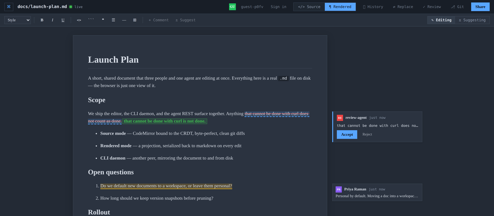
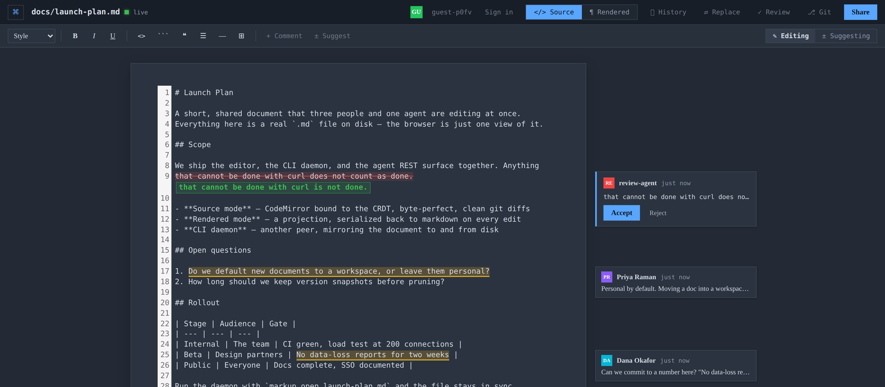

# Markup — Google Docs for Markdown

[](https://github.com/jrc9862/markup-editor/actions/workflows/ci.yml)


**Real-time multiplayer editing on plain `.md` files.** The document you
collaborate on in the browser *is* the file in your repo: a two-way CLI keeps
the browser, your file system, and git in sync — no copy-paste tax, clean
diffs.

**Agents are a first-class audience, not an afterthought.** Every human
capability has a plain-REST equivalent, locations can be addressed by quoting
text instead of computing offsets, and suggestions are the agent-native write
mode — an agent proposes, a human accepts, and the change lands in the real
file.

## What is this

Markup pairs a browser editor with a CLI daemon over a shared Yjs CRDT
document. Open a file with `markup open`, and every edit — from the browser,
from a teammate, from an agent hitting the REST API, or from your own editor
on disk — merges into the same canonical text and lands in the real `.md`
file, live. There's no export step and no separate "collaborative" format:
the source of truth is the markdown itself.



*Rendered mode. The margin cards are live comments and an agent's suggestion,
posted over REST while the document was open — accept it and the change lands
in the `.md` file on disk.*

## Why it exists

Google Docs-style collaboration and git-native markdown workflows don't
normally mix — real-time co-editing tools own their own document format, and
markdown tools don't merge concurrent edits. Markup exists to close that gap:
plain files, real-time CRDT merging, and a REST surface built so an agent can
participate the same way a human does — proposing suggestions instead of
overwriting text underneath someone's cursor.

## Highlights

- **Two editing modes over one canonical document** — a byte-perfect
  CodeMirror source mode and a WYSIWYG TipTap rendered mode, both bound to the
  same Yjs CRDT so they merge char-by-char and never clobber concurrent peers.

  

  *The same document, same moment, source mode — annotations stay anchored to
  the text across both views.*
- **Your file, live** — `markup open file.md` runs a daemon that mirrors the
  document to disk (and back) as a Yjs peer; edits from any browser tab,
  agent, or the disk converge, producing clean git diffs.
- **Comments & suggestions** that sync, resolve, and persist like edits, with
  ranges anchored to the text so they survive concurrent editing.
- **Realtime suggesting mode** — an Editing/Suggesting toggle in both modes;
  while suggesting, your keystrokes fold into reviewable GitHub-style
  suggestions instead of touching the doc.
- **Full agent REST surface + MCP server** — everything in the UI is
  reachable with `curl` and a bearer token, or through the `markup-mcp` stdio
  server.
- **Server-side history** with named versions, per-author attribution, and
  one-click restore.
- **Git-native flows** — commit / branch / checkout and PR-style batch
  suggestion review from the web UI or REST.
- **Enterprise identity** — OIDC & SAML 2.0 SSO, scoped API tokens, per-doc
  roles, workspaces, SCIM 2.0 provisioning, and a per-workspace audit log.

## Quick start

Requires Node.js >= 20.

```bash
npm install

# In separate terminals:
npm run dev:server     # ws + REST on :4000
npm run dev:web        # editor UI on :3000

# Open a real file and start collaborating:
npm run cli -- open path/to/file.md
```

Open the printed URL in two tabs — edits converge in both tabs *and* in the
file on disk. Zero setup: no database or SSO required for local dev (SQLite is
used automatically, and `dev:server` sets a `dev-token` bearer).

## How it works

The canonical document is the raw markdown string, held in a Yjs `Y.Text`
named `content`. Everything else is a view of it: source mode (CodeMirror 6)
binds to the `Y.Text` directly for true char-level CRDT merging; rendered mode
(TipTap) is a projection that re-parses remote changes into ProseMirror and
serializes local WYSIWYG edits back to markdown; the CLI daemon is just
another peer, minimal-diffing disk changes in and writing `Y.Text` changes
back out. The keystone is `applyStringToYText()` in
`packages/sync-core/src/ytext.ts`, which reconciles a `Y.Text` to a target
string with minimal char-level ops in a single transaction, so full-string
writers (disk, the WYSIWYG serializer) still merge cleanly with concurrent
peers. Full architecture write-up in [`CLAUDE.md`](./CLAUDE.md).

## Agent surface

Everything in the UI is reachable over REST; routes operate on the live
Y.Doc, so agent actions reach every connected human (and the disk) in
realtime. A quick smoke test with the local dev token:

```bash
curl -H "Authorization: Bearer dev-token" http://localhost:4000/api/docs
```

Range-taking routes accept `{from,to}` offsets **or** `{anchorText,
occurrence?}` — quote the text you mean and the server finds it. Agents should
run on a scoped API token; `suggest` (propose, never write) is the
agent-native default. See the "Agent surface (REST)" section of
[`CLAUDE.md`](./CLAUDE.md) for the full route list, and
[`packages/mcp-server`](./packages/mcp-server) for the MCP wrapper.

## Layout

```
apps/server/         Hocuspocus WS server + Express REST + SQLite/Postgres persistence
apps/web/            Next.js editor (source + rendered modes, presence)
packages/sync-core/  applyStringToYText, shared types, presence helpers
packages/cli/        `markup` CLI: open/sync/status + two-way disk daemon
packages/mcp-server/ `markup-mcp`: stdio MCP server over the agent REST surface
```

## Common commands

```bash
npm run dev:server     # ws + REST server (:4000, tsx watch)
npm run dev:web        # editor UI (:3000, next dev)
npm run cli -- open path/to/file.md   # two-way disk sync for a file
npm test               # all unit tests (vitest, in sync-core)
npm run build          # build every workspace

# Single test file / single test:
npm run test --workspace @markup/sync-core -- src/ytext.test.ts
npm run test --workspace @markup/sync-core -- -t "accepts a suggestion"

# Type-check without emitting (no lint setup; tsc is the checker):
npx tsc -p packages/sync-core/tsconfig.json --noEmit
cd apps/web && npx tsc -p tsconfig.json --noEmit

# Add a dependency to one workspace (never bare `npm install` at root):
npm install --workspace @markup/web <pkg>
```

## Deployment

Production is a Docker Compose stack: Postgres for persistence, plus server
and web images built from `apps/server/Dockerfile` and `apps/web/Dockerfile`.

```bash
docker compose --profile app up -d --build
```

Web on `:3000`, server (REST + WS) on `:4000`. `docker-compose.scale.yml`
layers on a multi-node overlay (Redis for cross-node Yjs/awareness fan-out,
nginx as a WS-aware load balancer) for running multiple server replicas — see
the comments at the top of that file for the full command. Load testing for
that path lives in [`k6/`](./k6), covering WS connection capacity and REST
throughput.

## Configuration

Zero config runs on SQLite with a dev token. For production, storage is
selected by `DATABASE_URL` (Postgres when set, SQLite otherwise). Identity
(OIDC, SAML, scoped tokens, workspaces, SCIM provisioning, audit logging),
rate limits, git flows, and multi-node Redis fan-out are all env-gated and off
by default. The authoritative list of environment variables and the full
enterprise identity/ops design lives in [`CLAUDE.md`](./CLAUDE.md) and its
linked phase docs.

## Troubleshooting

**`ERR_DLOPEN_FAILED` / `NODE_MODULE_VERSION` mismatch on `npm run dev:server`.**
`better-sqlite3` is a native addon and must be built for the Node major you run.
The project targets Node 22 (CI, Dockerfiles, `.nvmrc`):

```bash
nvm use                          # picks up .nvmrc -> Node 22
npm rebuild better-sqlite3       # only if you switched Node after installing
```

## License

No license file is currently published in this repository.
